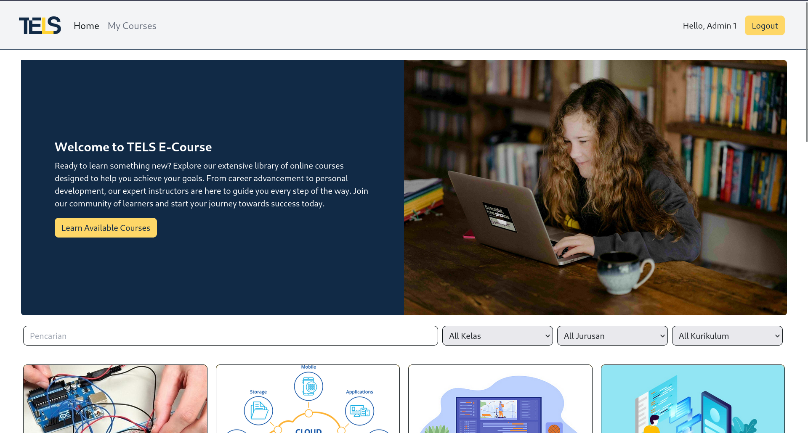
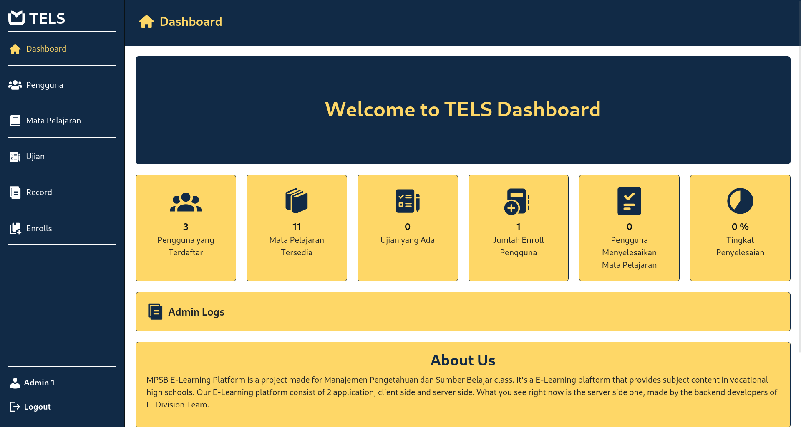
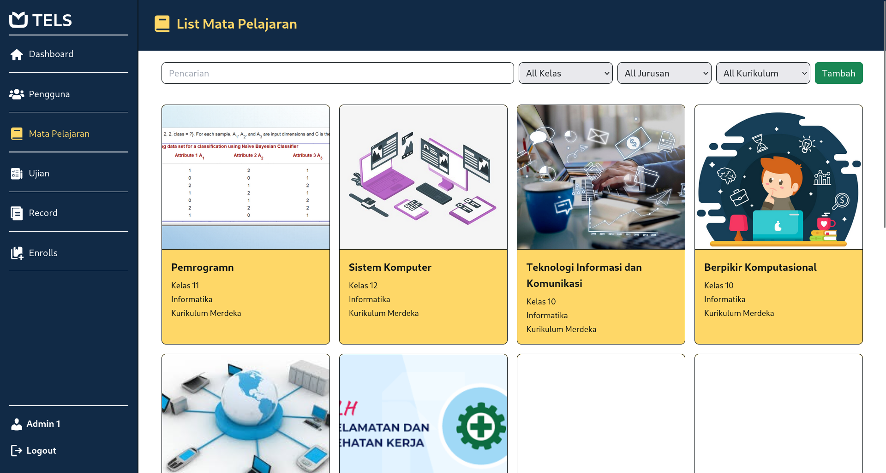
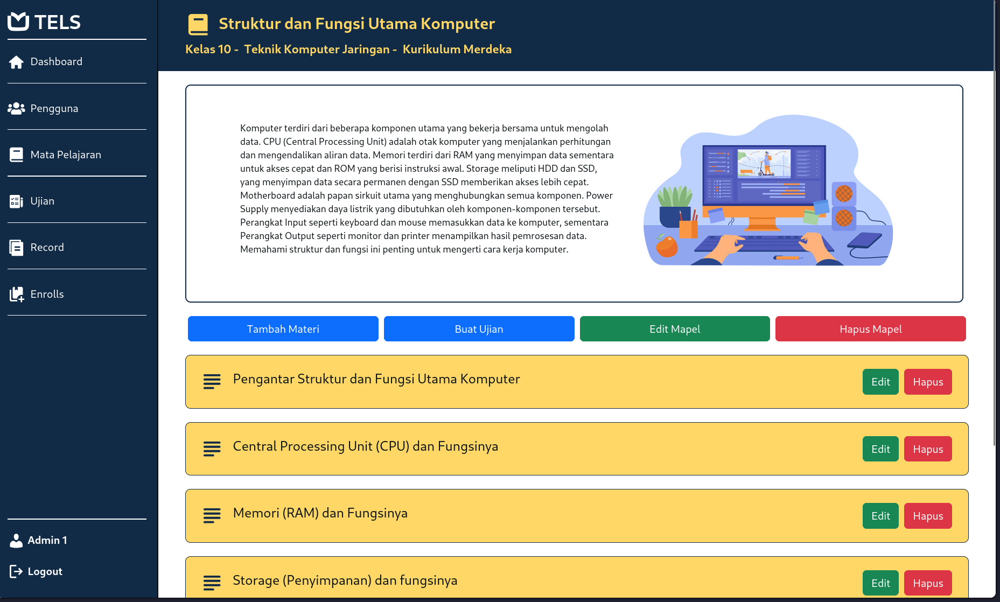
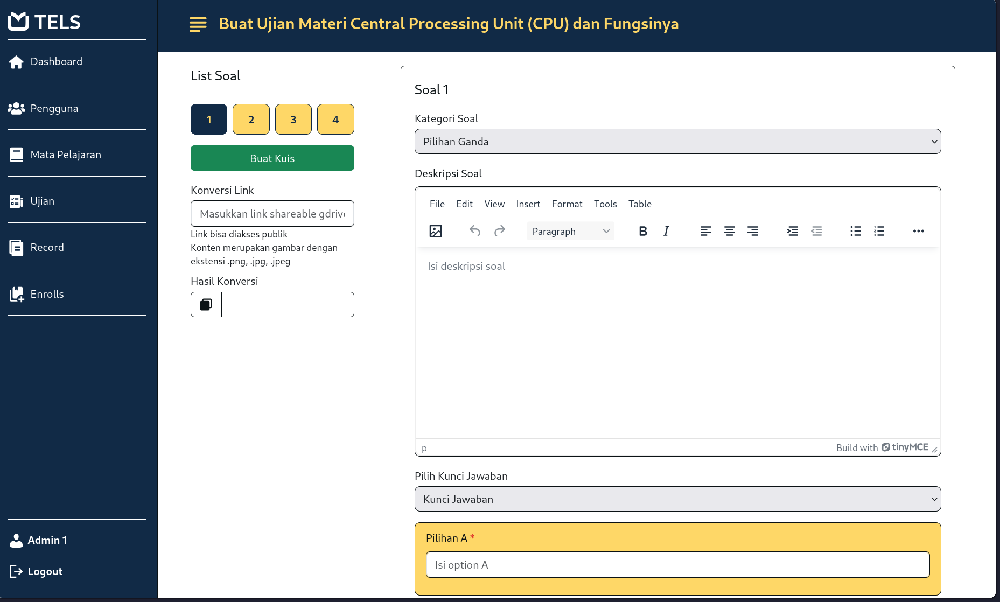
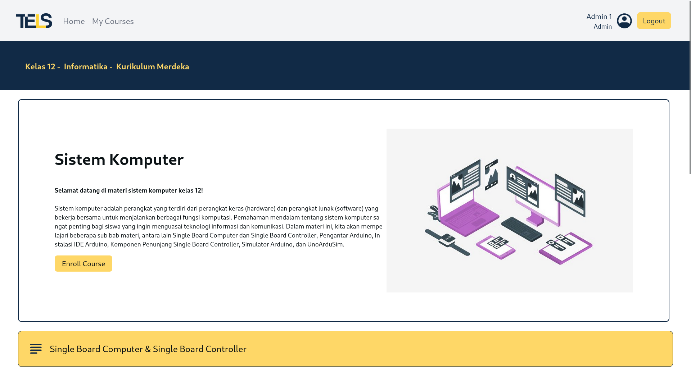
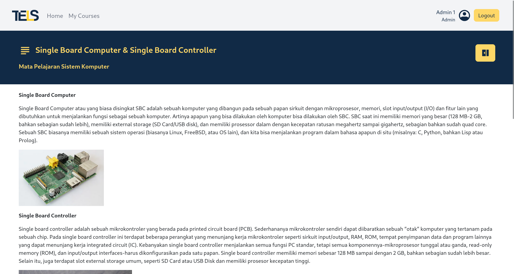
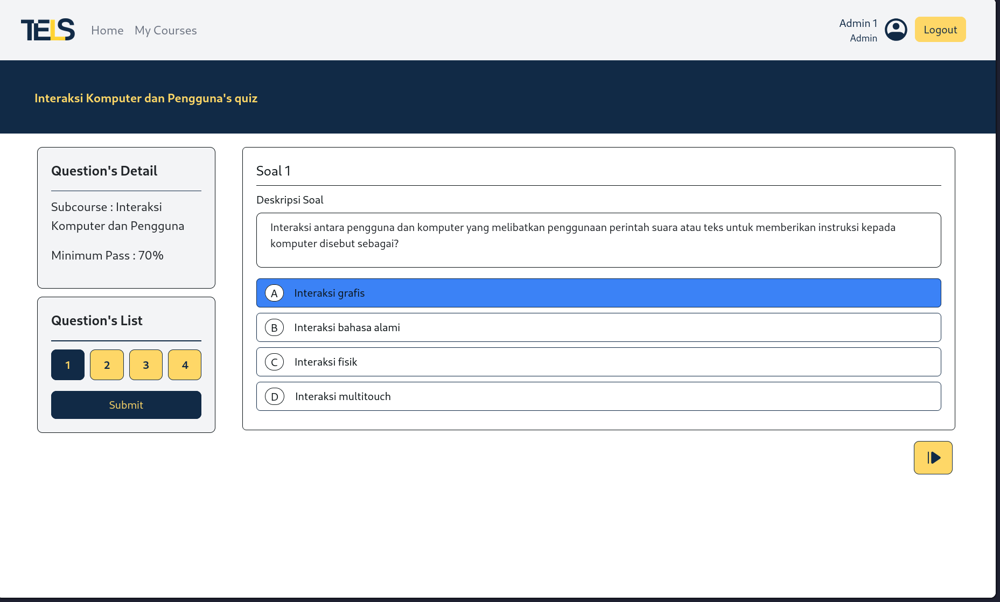

# TELS E-Course



## 🤔 What is TELS?

Innovative online e-learning platform designed specifically for vocational school students. TELS offers a comprehensive library of rich, high-quality vocational course materials tailored to meet the unique needs of students pursuing specialized skills. With a focus on career advancement and personal development, the platform combines expert-led instruction with engaging content to create an interactive and practical learning experience.

## 🛢️ Database Design


## 🔍 Application Preview

### Admin View





### User View





## ⚙️ Development Setup

You need `firebase-adminsdk credential` json file to setup dev for this project.

1. Clone this github repository

```zsh
git clone https://github.com/devanfer02/tels-e-course.git
```

2. Navigate to the directory and install all dependancies

```zsh
composer install 
npm install
```

3. Generate firebase admin credentials json file from firebase and place it in `config/firebase` directory

4. Configure the application `.env`, put the firebase admin sdk credential json file path to `FIREBASE_CREDENTIALS` variable

```zsh
cp .env.example .env
```

5. Generate the application key
```zsh
php artisan key:generate
```

6. Migrate database to create database tables and seed it to provide initial data
```zsh
php artisan migrate --seed
php artisan db:seed --class=UserSeeder
```

7. You can also seed it with some dummy data using `DummySeeder.php` class
```zsh
php artisan db:seed --class=DummySeeder
```

8.  Run the application 
```zsh
npm run dev
php artisan serve
```

9. Visit [localhost:8000](http://localhost:8000) to view the application


## 🛠️ Dependencies

<table border="1">
  <tbody>
    <td>Framework</td>
      <td></td>
    </tr>
    <td>Languange</td>
      <td></td>
    </tr>
    <td>Databases</td>
      <td></td>
    </tr>
  </tbody>
</table>
